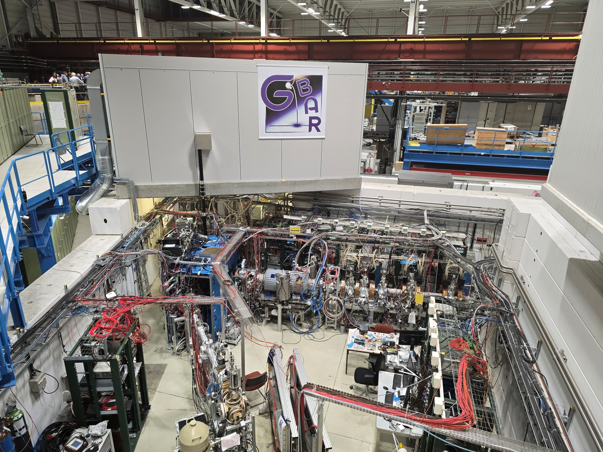

# IMS Group Meeting 2024

On September 12, 2024, the International Expert Group for Market Surveillance (IMS) held its annual meeting at CERN. The meeting brought together representatives from **28 exchanges and regulators** to share experiences, discuss new developments in market surveillance, and explore technical innovations shaping the future of financial market oversight.

IMS Group is an independent platform connecting exchanges, regulators, and researchers working on practical, scientifically grounded approaches to market surveillance. This year’s gathering combined live demonstrations, research presentations, and informal discussions aimed at strengthening collaboration across the community.

## Demonstration of MSA Lab

The meeting featured a demonstration of the Market Surveillance Analytics Lab (MSA Lab), a new scientific framework for developing, validating, and deploying manipulation detection methodologies. All IMS Group members were able to participate in a live demo using their own devices, exploring the Lab's capabilities in real-time.

More information about the MSA Lab can be found at [highlo.org/msalab](https://highlo.org/msalab).

## Presentations by IMS Group Members

Several IMS Group members shared recent research and operational developments across a range of topics.
The presentations included insights into new enforcement practices against market manipulation, legal considerations surrounding the use of artificial intelligence in surveillance, techniques for detecting order book imbalances, and the evolving challenges in monitoring energy markets.

## Visit to the Antimatter Factory

Following the technical sessions, participants visited CERN's Antimatter Factory, where cutting-edge physics research inspired further reflections on scientific collaboration and innovation. The day concluded with a dinner at Le Socrate in Geneva, offering an opportunity to continue discussions in an informal setting.

    
    <figcaption style="font-size: 0.9em; color: #666;">The Gravitational Behaviour of Antimatter at Rest (GBAR) experiment at CERN, photo taken by a participant during the visit.</figcaption>

## Reflections on the Meeting

The 2024 IMS Group Meeting highlighted the importance of cross-sector collaboration, combining operational expertise, legal insights, and technical innovation. The open exchange of ideas and live demonstrations underscored the group's commitment to advancing market surveillance practices in a rapidly evolving landscape. 

> "Thank you for organizing and hosting this great meeting! It was a pleasure to talk to all of you again and to have fruitful conversations. Apart from that, lunch and dinner really were delicious. Thank you for providing the MSA Lab – it offers a great opportunity to explore some data."
>
> — Anonymous IMS Group participant

We sincerely thank all participants for their valuable contributions and look forward to building on the initiatives discussed.

## IMS Group Meeting 2025

The next IMS Group Meeting will be held on September 25, 2025. For more information, please contact info@highlo.org.