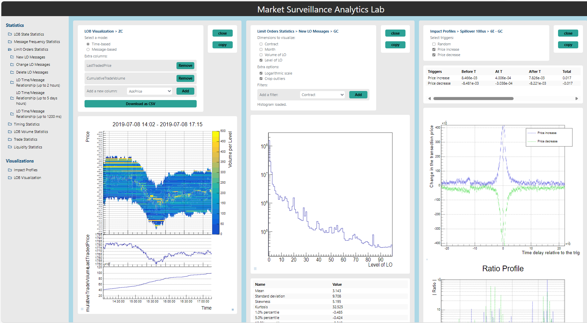

# MSA Lab: Advancing Market Surveillance with High-Energy Physics Tools  

For the past several years, the **Market Surveillance Analytics Lab (MSA Lab)** has been developed as part of **HighLO**. By applying computational techniques originally designed for **high-energy physics (HEP)**, the MSA Lab provides regulators and exchanges with a scalable, transparent, and scientifically rigorous approach to detecting market manipulation.  

## Bridging High-Energy Physics and Financial Market Analysis  

Financial markets generate vast amounts of high-frequency data, requiring **efficient, high-performance analysis methods** to detect anomalies. Many of the challenges faced in market surveillance—such as identifying rare patterns in large datasets—are similar to those encountered in particle physics. The MSA Lab leverages **ROOT**, a data analysis framework developed at CERN, to bring **high-speed processing and statistical precision** to financial market surveillance.  

## Key Features of the MSA Lab  

* **High-Frequency Data Processing with ROOT** – Handling large-scale financial data requires specialized tools. **ROOT**, originally designed to process petabytes of data from particle physics experiments, enables the MSA Lab to analyze market activity at the **microsecond level**, ensuring detailed and accurate detection of manipulative behavior.  

* **Interactive Market Visualization** – Understanding market behavior requires more than just raw data—it requires **intuitive visualization tools**. The MSA Lab includes an **interactive LOB visualization module**, allowing regulators to explore trading patterns across different time scales, from high-level trends to individual transactions.  

* **Measuring the Market Impact on a Microsecond Level** – Market events do not occur in isolation. The **impact profile module** in MSA Lab allows regulators to analyze how specific market events, such as price movements, affect other markets over time. This provides deeper insights into interdependencies and potential spillover effects.  

* **Rule-Based Manipulation Detection** – The MSA Lab identifies market manipulation using clearly defined statistical rules, avoiding black-box AI models.

* **A Transparent and Customizable Framework** – Unlike many existing market surveillance systems, MSA Lab prioritizes **transparency and customizability**. Regulators and exchanges using the system gain **full access to the source code**, ensuring that methodologies can be validated and tailored to specific market needs.  

## Designed for Regulators and Exchanges  

The MSA Lab is designed **exclusively for regulators and regulated exchanges**, with access provided through the **International Epert Group on Market Surveillance (IMS)**. Unlike commercial compliance tools, it is not available to private trading firms, ensuring that the methodologies used for detecting market manipulation remain secure and cannot be exploited.  

## Advancing Market Surveillance Through Scientific Collaboration  

The MSA Lab represents a continued effort to apply **scientific methodologies to financial markets**, demonstrating the value of interdisciplinary collaboration between **finance and high-energy physics**. By integrating advanced data analysis techniques into market surveillance, it enables regulators and exchanges to enhance **efficiency, accuracy, and transparency** in detecting market manipulation.  

## Try the Demo hosted at CERN

A demo version of the MSA Lab is hosted at CERN, showcasing key functionalities including high-frequency data visualization, impact analysis, and manipulation detection. This demo allows prospective collaborators to explore the platform's capabilities and evaluate its potential for regulatory use.

To request full access or discuss potential collaboration, please contact info@highlo.org.

    

<a href="https://hdash.cern.ch/" style="display: inline-block; margin-top: 1.5rem; padding: 0.75rem 1.5rem; background-color: {{ site.colors.green }}; color: #ffffff; text-decoration: none; font-weight: 600;">
    Try the Demo
</a>

